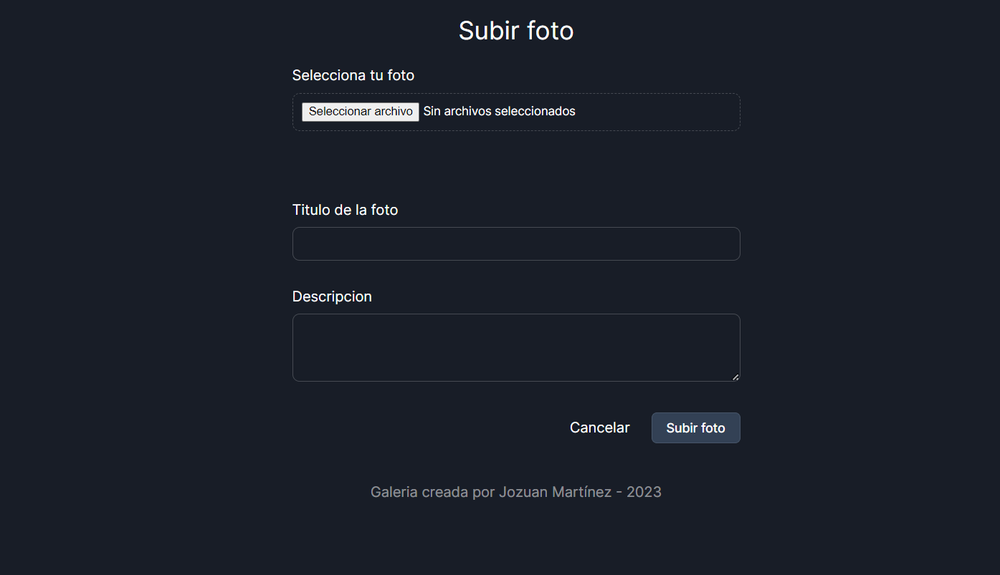
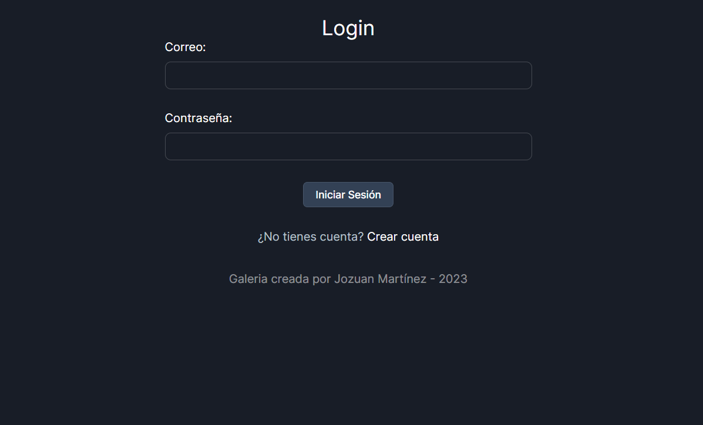
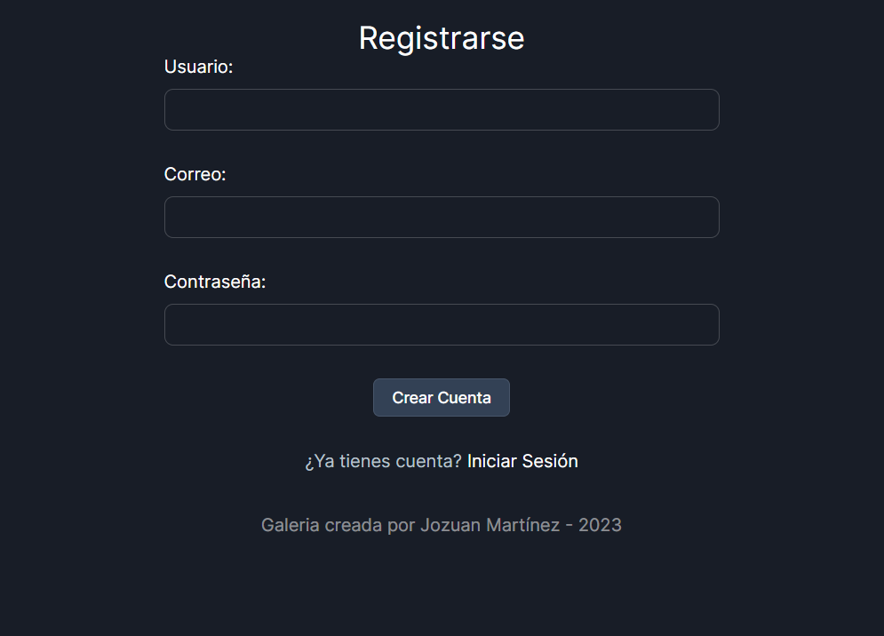

# Gallery PHP

A simple image gallery web application created using PHP, HTML, CSS, JavaScript, and MySQL.

## Motivation

This project was developed to enhance my PHP skills and serve as a learning exercise. It's inspired by the project from the Falcon Master PHP course, but I added a lot of features.


## Features

- **User Registration and Login**: Users can create accounts, log in, and manage their profiles.
- **Image Upload**: Registered users can upload images along with titles and descriptions.
- **Image Gallery**: All uploaded images are displayed in a gallery format for easy navigation.
- **Image Management**: Users can edit the titles and descriptions of their uploaded images.

## Getting Started

To run this project locally, follow these steps:

1. **Clone this repository.**

1. **Set up a local web server**: You can use web server software like XAMPP or MAMP. Configure it to run PHP.

1. **Database Setup**: Create a MySQL database and define the required tables using the following SQL code:

   ```sql
    CREATE TABLE photos (
        id INT AUTO_INCREMENT PRIMARY KEY,
        title VARCHAR(50) NOT NULL,
        description VARCHAR(255) NOT NULL,
        img_url VARCHAR(255) NOT NULL,
        user_id INT NOT NULL,

        CONSTRAINT photos__users_fk
            FOREIGN KEY (user_id) REFERENCES users (id)
    );

    CREATE TABLE users (
        id INT auto_increment PRIMARY KEY,
        username VARCHAR(50) NOT NULL,
        email VARCHAR(50) NOT NULL,
        password VARCHAR(255) NOT NULL,

        CONSTRAINT users_pk2 UNIQUE (email)
    );
    Install Dependencies: Before running the project, you need to install its dependencies. Use the following command to install them:
1. **Install Dependencies**: Before running the project, you need to install its dependencies. Use the following command to install them:

    ```bash
    composer install
    ```
1. **Environment Variables**: Rename the .env.template file to .env and update the variable values as needed.

1. **Access the Project**: Open the project in your web browser.


## Screenshoots

Home Page


Details Page


Upload Page


Update Page


Login Page


Register Page

